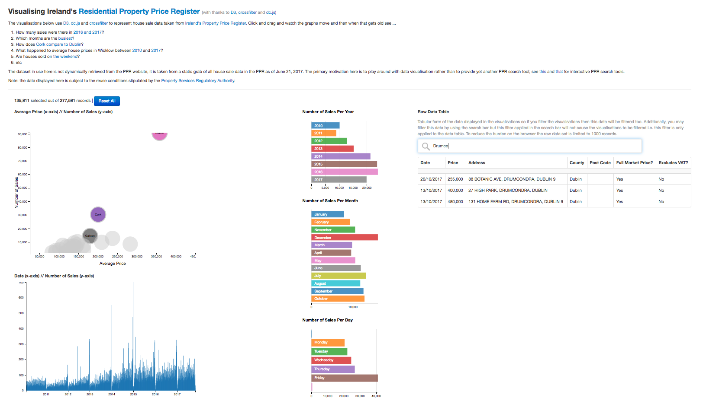

About
======

> Data visualisation using data from Ireland's Residential Property Price Register

A quick hack using data from Ireland's [Residential Property Price Register](https://www.propertypriceregister.ie/website/npsra/pprweb.nsf/page/ppr-home-en) to play around with [D3](http://d3js.org), [dc.js](http://nickqizhu.github.io/dc.js/) and [crossfilter](http://square.github.io/crossfilter/) data visualisation. The dataset in use here is not dynamically retrieved from the PPR website, it is taken from a static grab of house sale data from the PPR. The primary motivation here is to play around with data visualisation rather than to provide yet another PPR search tool.

This tool uses a static dump of the PPR data, so by the time you (or anyone) looks at it the data will likely be somewhat out of data. That said, I periodically grab a fresh copy of the data so you might be in luck. However, the primary purpose of this tool is to play around with  in-browser data visualisation tools so the staleness (or otherwise) of the data is secondary. Regardless of how recently the PPR dump was taken there will be several years of data available for visualisation.

#### What Does It Look Like?

#### Acknowledgement

In accordance with the [PRSA's copyright conditions](http://www.psr.ie/website/npsra/npsraweb.nsf/page/copyright-en) it is hereby acknowledged that the PRSA is the source of this data and holds the copyright on this data. The data provided by PRSA:

* Is being reproduced accurately
* Is not being used in a misleading way
* Is not being used for advertising or product promotion
* Is not being used for or in support of illegal, immoral, fraudulent or dishonest purposes. 

License
-------

The software in this repository (but not the PRSA data) is ...
 
    Licensed under the Apache License, Version 2.0 (the "License");
    you may not use this file except in compliance with the License.
    
    You may obtain a copy of the License at

       http://www.apache.org/licenses/LICENSE-2.0

    Unless required by applicable law or agreed to in writing, software
    distributed under the License is distributed on an "AS IS" BASIS,
    WITHOUT WARRANTIES OR CONDITIONS OF ANY KIND, either express or implied.
    See the License for the specific language governing permissions and
    limitations under the License.